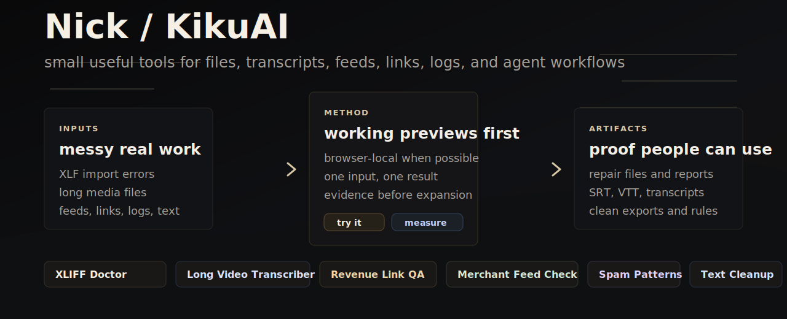

  

<h1 align="center">Nick</h1>

  I build small useful tools for files, transcripts, feeds, links, logs, and agent workflows.
  The point is not the stack. The point is whether someone can open the tool, get a useful artifact, and decide with evidence.

  <a href="https://kikuai.dev">kikuai.dev</a>
  |
  <a href="https://kikuai.dev/tools/">all tools</a>
  |
  <a href="https://kikuai.dev/open-source/">code references</a>
  |
  <a href="https://www.linkedin.com/in/kiku-jw/">linkedin</a>

## Open By Job

| If this is the problem | Open this | You should get |
| --- | --- | --- |
| Articulate rejects a translated XLF/XLIFF file | [XLIFF Import Doctor](https://kikuai.dev/fix-articulate-xliff-import-error/) | Diagnosis, safe repair, import report |
| A long video needs private subtitles or transcript | [Long Video Transcriber](https://kikuai.dev/translator-ready-srt/) | Transcript, SRT, VTT |
| A recommendation page may leak revenue through broken links | [Revenue Link Health Checker](https://kikuai.dev/revenue-link-health-checker/) | Local risk report |
| Merchant feed or Shopify export data looks wrong | [Merchant Feed Leak Checker](https://kikuai.dev/tools/google-shopping-feed-leak-checker/) | Feed drift and leak report |
| Spam logs need repeated patterns, not one-message guesses | [Spam Pattern Report](https://kikuai.dev/tools/spam-pattern-report/) | Pattern groups and review rules |
| Copied/PDF text is noisy before reuse or AI prompting | [Document Text Cleaner](https://kikuai.dev/tools/document-text-cleaner/) | Clean text and cleanup report |
| Logs or CSV need obvious values masked before sharing | [Local Text / CSV Masker](https://kikuai.dev/tools/local-data-masker/) | Masked copy and finding report |

## What I Optimize For

| Principle | What it means in practice |
| --- | --- |
| Useful before impressive | One input, one action, one artifact people can inspect. |
| Browser-local when possible | Private files should stay on the user's device unless a product truly needs a server. |
| Proof before expansion | Usage, exports, paid intent, and customer work beat vague roadmap energy. |
| Agents need tools, not posture | A good product can become a deterministic backend, validator, repair step, or structured artifact source. |

## Working Repos

| Area | Repos |
| --- | --- |
| Public KikuAI tools | [long-video-transcriber](https://github.com/KikuAI-Lab/long-video-transcriber), [articulate-xliff-import-doctor](https://github.com/KikuAI-Lab/articulate-xliff-import-doctor), [revenue-link-health-checker](https://github.com/KikuAI-Lab/revenue-link-health-checker), [merchant-feed-leak-checker](https://github.com/KikuAI-Lab/merchant-feed-leak-checker) |
| Agent/workflow infrastructure | [agx-core](https://github.com/kiku-jw/agx-core), [codex-skills](https://github.com/kiku-jw/codex-skills), [agent-spec-bundle](https://github.com/kiku-jw/agent-spec-bundle), [issue-control-loop](https://github.com/kiku-jw/issue-control-loop), [session-to-post](https://github.com/kiku-jw/session-to-post) |
| Practical utilities | [ClipStash](https://github.com/kiku-jw/ClipStash), [site-blocker](https://github.com/kiku-jw/site-blocker), [peak-crossover-mouse-fix](https://github.com/kiku-jw/peak-crossover-mouse-fix) |

Archive and references

Earlier repos stay public when they still explain a useful direction: [Chart2CSV](https://github.com/kiku-jw/Chart2CSV), [DocStripper](https://github.com/kiku-jw/DocStripper), [Masker](https://github.com/kiku-jw/masker), [reliapi](https://github.com/kiku-jw/reliapi), [spatial-scene-api](https://github.com/kiku-jw/spatial-scene-api), [routellm](https://github.com/kiku-jw/routellm), [thread-router](https://github.com/kiku-jw/thread-router), [kyuva](https://github.com/kiku-jw/kyuva).

## Elsewhere

[CV](./CV.md) | [Telegram blog](https://t.me/kiku_ai) | [Music](https://suno.com/@kiku_jw)
